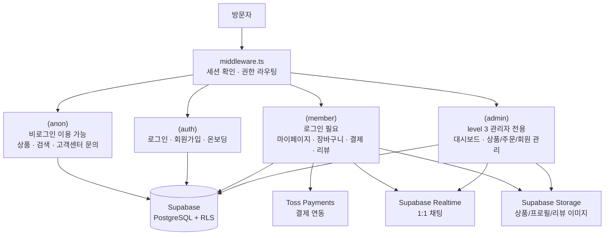

# 👕 T-Mall - 패션 온라인 쇼핑몰

<p align="center">
  <br>
  
  <br>
</p>
<h4 align="center">👕 T-Mall - 티셔츠부터 아우터까지, 합리적인 가격의 패션 쇼핑몰 👕</h4>
<h5 align="center">배포 링크 : <a href="#">배포 후 링크 추가 예정</a></h5>
<h5 align="center">테스트 계정 ID/PW : testuser@tmall.com / test1234</h5>

<br>

## 💻 프로젝트 소개

<p align="justify">
 <b>T-Mall</b>은 티셔츠부터 아우터까지, 다양한 사이즈와 합리적인 가격의 상품을 만나볼 수 있는 패션 온라인 쇼핑몰입니다. 상품 탐색부터 장바구니, 결제, 리뷰, 쿠폰, 1:1 실시간 문의까지 이커머스에 필요한 흐름을 갖추고 있으며, 일반 회원 · 판매자(셀러) · 관리자 3단계 권한에 따라 접근 가능한 기능이 나뉘는 구조로 설계되어 있습니다.
</p>

<br>

## 🛠 기술 스택

| 구분 | 스택 |
| :--- | :--- |
| Frontend |    |
| Styling |   |
| 상태/데이터 |   |
| Backend/DB |   |
| 결제 |  |
| 기타 |   |

<br>

## 🏛 아키텍처

Supabase Auth 세션을 기준으로 `middleware.ts`가 모든 요청의 진입점에서 로그인 여부와 권한(`level`)을 검사해 라우트 그룹별 접근을 제어합니다.



<br>

## ✨ 주요 기능

### 👤 회원 시스템

이메일/비밀번호 회원가입과 **Google OAuth 로그인**을 지원합니다. 소셜 로그인으로 처음 가입한 사용자는 **온보딩** 페이지에서 닉네임을 설정한 뒤에만 서비스를 이용할 수 있습니다.

권한은 `일반 회원(level 1)` · `판매자(level 2)` · `관리자(level 3)` 3단계로 나뉘며, `middleware.ts`가 요청마다 이를 검사해 판매자 전용(`/manage`) · 관리자 전용 라우트에 대한 접근을 제어합니다. 정지된 계정은 별도의 안내 페이지(`/restricted`)로 이동합니다.

아이디/비밀번호 찾기, 프로필(닉네임·프로필 이미지) 수정, 민감한 정보 변경 시 비밀번호 재확인(5분 만료) 등의 계정 관리 기능을 제공합니다.

### 🛍 상품 탐색

카테고리별 상품 목록, 검색, 상품 상세 페이지(이미지 갤러리, 상세 설명, 문의, 리뷰 탭)를 제공합니다. 상품 상세 진입 시 조회수가 집계되고, 최근 본 상품이 클라이언트에 저장되어 노출됩니다. 로그인한 사용자는 상품을 찜(즐겨찾기)할 수 있습니다.

### ✒ 리뷰

구매한 상품에 대해 별점과 사진(최대 5장)을 첨부한 리뷰를 작성할 수 있습니다. 다른 사용자의 리뷰에 "도움돼요" 표시를 남길 수 있고, 본인이 작성한 리뷰는 수정·삭제가 가능합니다.

### 💬 상품 문의 & 고객센터

상품별 1:1 문의(비밀글 지원, 판매자 답변)와 별도의 고객센터 문의 게시판(검색, 페이지네이션, 이미지 첨부)을 모두 제공합니다.

### 🛒 장바구니 & 결제

장바구니 담기와 상품 상세에서 바로 구매하는 **바로결제** 두 가지 구매 흐름을 지원합니다. **Toss Payments**를 연동해 결제를 처리하고, 결제 성공/실패에 따른 결과 페이지, 주문 내역/주문 상세 조회 기능을 제공합니다.

### 🎟 쿠폰

발급된 쿠폰을 마이페이지에서 다운로드할 수 있고, 이미 받은 쿠폰은 중복 다운로드가 되지 않도록 처리되어 있습니다. 보유 중인 쿠폰과 사용 완료한 쿠폰을 구분해서 확인할 수 있습니다.

### 💬 실시간 1:1 채팅

**Supabase Realtime**을 이용한 사용자-관리자 실시간 채팅을 지원합니다. 관리자는 전체 채팅방 목록에서 안 읽은 메시지를 확인하고 응대할 수 있습니다.

### 🛠 관리자 대시보드

판매자/관리자는 별도의 관리자 레이아웃(`/manage`)에서 아래 기능을 이용할 수 있습니다.

- **대시보드**: Chart.js 기반 매출 현황, 카테고리별 판매 비중, 최근 주문 목록
- **상품 관리**: 상품 등록/수정/삭제, 다중 이미지 업로드
- **주문 관리**: 전체 주문 목록 및 상세 조회
- **회원 관리**: 회원 목록/상세 조회, 계정 상태(정지 등) 관리

<br>

## 📁 디렉터리 구조

```
T-Mall
├─ app
│  ├─ (admin)              # 관리자 전용 (level 3)
│  │  └─ manage
│  │     ├─ dashBoard      # 매출/카테고리 통계, 최근 주문
│  │     ├─ productList    # 상품 목록/삭제
│  │     ├─ regist         # 상품 등록
│  │     ├─ edit/[id]      # 상품 수정
│  │     ├─ orderList      # 주문 목록/상세
│  │     └─ user           # 회원 목록/상세
│  ├─ (anon)                # 비로그인 이용 가능
│  │  ├─ category
│  │  ├─ search
│  │  ├─ events
│  │  ├─ inquiry           # 고객센터 문의 게시판
│  │  ├─ policy            # 이용약관/개인정보처리방침
│  │  └─ products/[id]     # 상품 상세
│  ├─ (auth)                # 로그인/회원가입
│  │  ├─ signin / signup
│  │  ├─ find-id / find-password / reset-password
│  │  └─ onboarding
│  ├─ (member)               # 로그인 필요
│  │  ├─ mypage
│  │  │  ├─ myCart / orderList / delivery
│  │  │  ├─ coupon / bookmark / review / inquiry
│  │  │  └─ profile
│  │  ├─ productReview/[id]  # 리뷰 작성/수정
│  │  ├─ directCheckout      # 바로결제
│  │  └─ restricted          # 정지 계정 안내
│  └─ api
│     ├─ auth                # OAuth 콜백, 아이디 찾기, 중복확인
│     └─ toss/confirm        # 결제 승인
├─ components
│  ├─ common                 # 주소검색, 버튼, 모달, 상품 카드 등 공용 컴포넌트
│  ├─ layout                 # Header/Footer/Main
│  ├─ providers               # AuthProvider, ReactQueryProvider
│  └─ ui                      # shadcn 기반 UI + 채팅/툴 컴포넌트
├─ hooks                      # useDebounce, useImagePreview 등
├─ lib
│  ├─ actions                # Server Actions (admin/auth)
│  ├─ config/supabase         # 클라이언트/서버/미들웨어용 Supabase 설정
│  ├─ queries                 # 도메인별 API 함수 (admin/auth/products/storage)
│  ├─ store                   # Zustand 스토어
│  └─ utils                   # 이미지 압축 등 순수 유틸 함수
├─ middleware.ts               # 인증/권한 기반 라우트 제어
└─ types
```

<br>

## 🔐 권한 구조

| Level | 역할 | 접근 가능 범위 |
| :---: | :--- | :--- |
| 1 | 일반 회원 | 비로그인 페이지 + 마이페이지 전체 |
| 2 | 판매자 | 1의 권한 + `/manage`(상품 등록/수정/주문 관리) |
| 3 | 관리자 | 2의 권한 + 회원 관리, 전체 대시보드 |
